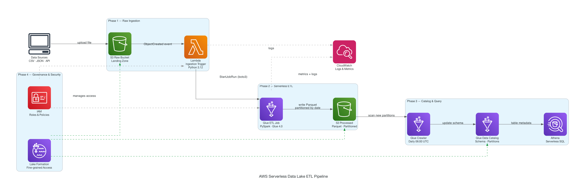

<div align="center">

# Serverless Scalable Data Lake ETL on AWS

**End-to-end, event-driven data lake pipeline — fully serverless, zero server management.**

[](https://aws.amazon.com/)
[](https://python.org)
[](https://terraform.io)
[](https://spark.apache.org/)
[](#testing)

</div>

---

## Pipeline Architecture

> Drop a file → everything else is automatic.

<p align="center">
  
</p>

<p align="center">
  <a href="docs/architecture.svg"><strong>▶ Open animated version</strong></a> — drag <code>docs/architecture.svg</code> into your browser to see live data flow animations
</p>

---

## What This Builds

A production-grade, fully serverless data lake on AWS. Drop a CSV or JSON file into S3 — the entire pipeline fires automatically: Lambda validates and organizes the file, Glue transforms it to partitioned Parquet, the Glue Crawler updates the schema catalog, and Athena is ready for SQL queries — all without touching a server.

**Key properties:**
- **Zero server management** — Lambda + Glue handle all compute
- **Scales to any file size** — Glue runs distributed PySpark, not Lambda memory limits
- **Cost-optimized** — pay only per invocation / DPU-hour / TB scanned
- **Extensible by design** — add a new data source by dropping a file; no infra changes
- **Governance-first** — Lake Formation controls access at column and row level

---

## Tech Stack

| Layer | Service | Role |
|-------|---------|------|
| **Storage** | AWS S3 | Raw landing zone + processed data lake |
| **Compute** | AWS Lambda (Python 3.12) | Event-driven ingestion trigger |
| **ETL** | AWS Glue (PySpark / Glue 4.0) | Distributed transformation engine |
| **Catalog** | AWS Glue Data Catalog | Schema registry + partition metadata |
| **Query** | AWS Athena | Serverless SQL over S3 |
| **Governance** | AWS Lake Formation | Fine-grained table/column/row access |
| **Security** | AWS IAM + S3 SSE-AES256 | Least-privilege roles + encryption at rest |
| **Observability** | AWS CloudWatch | Lambda logs + Glue metrics |
| **IaC** | Terraform ≥ 1.5 | All infra defined as versioned code |

---

## Build Status

| Phase | Description | Status |
|-------|-------------|--------|
| **Phase 1** | Raw Ingestion — S3 + Lambda + IAM | ✅ Complete |
| **Phase 2** | Serverless ETL — Glue PySpark + Parquet | 🔄 In progress |
| **Phase 3** | Catalog & Query — Glue Crawler + Athena | ⏳ Pending |
| **Phase 4** | Governance & Security — Lake Formation + KMS | ⏳ Pending |

---

## Project Structure

```
.
├── terraform/                  # All AWS infrastructure as code
│   ├── main.tf                 # Provider, backend, locals
│   ├── variables.tf            # Config knobs (region, env, bucket suffix)
│   ├── s3.tf                   # 4 S3 buckets + lifecycle + event notifications
│   ├── iam.tf                  # Lambda exec role + Glue service role
│   ├── lambda.tf               # Ingestion trigger Lambda
│   ├── glue.tf                 # Glue ETL job + Crawler + Athena workgroup
│   └── outputs.tf              # All resource outputs
│
├── lambda/
│   └── ingestion_trigger/
│       └── handler.py          # Validates file, organizes to raw zone, starts Glue
│
├── glue/
│   └── transform_script.py     # PySpark ETL: clean → dedup → partition → Parquet
│
├── athena/
│   └── queries/
│       ├── orders_analysis.sql # Revenue, product, customer queries
│       └── events_analysis.sql # Funnel, traffic, conversion queries
│
├── tests/
│   ├── conftest.py             # AWS fake creds + env setup for all tests
│   ├── events/                 # Sample S3 event payloads for local testing
│   └── unit/
│       └── test_handler.py     # 14 unit tests for Lambda handler
│
├── sample_data/
│   ├── orders.csv              # 10 sample orders rows
│   └── events.json             # 8 clickstream events
│
├── scripts/
│   └── upload_test_data.py     # Upload sample data → trigger pipeline end-to-end
│
├── docs/
│   └── architecture.svg        # Animated pipeline diagram (open in browser)
│
├── architecture.py             # Generates docs/architecture.svg
├── Makefile                    # Common commands
├── PROCESS.md                  # Step-by-step build log + ADR
└── requirements-dev.txt        # Dev/test dependencies
```

---

## Quick Start

### Prerequisites

```bash
# Tools
brew install awscli terraform graphviz
pip install diagrams

# AWS credentials
aws configure   # or export AWS_PROFILE=your-profile
```

### 1. Clone & configure

```bash
git clone https://github.com/mathachew7/Serverless-Scalable-Data-Lake-ETL-on-AWS.git
cd Serverless-Scalable-Data-Lake-ETL-on-AWS

cp terraform/terraform.tfvars.example terraform/terraform.tfvars
# Edit terraform.tfvars — set bucket_suffix to something globally unique
```

### 2. Deploy infrastructure

```bash
make init       # terraform init
make plan       # review what gets created
make apply      # deploy to AWS (~2 min)
```

### 3. Trigger the pipeline

```bash
make upload-sample
# Uploads orders.csv + events.json → raw S3 bucket
# Lambda fires → Glue job starts → processed Parquet written
```

### 4. Query in Athena

Open the [Athena console](https://console.aws.amazon.com/athena), select the Glue database from Terraform output, then run:

```sql
-- Revenue by day
SELECT year, month, day, SUM(total_amount) AS revenue
FROM orders
WHERE status != 'cancelled'
GROUP BY year, month, day
ORDER BY year, month, day;
```

---

## How It Works

### Phase 1 — Raw Ingestion

```
CSV/JSON upload → S3 (uploads/)
                      ↓  ObjectCreated event
                  Lambda (Python 3.12)
                      ↓  validates extension + size
                      ↓  copies to raw/{fmt}/year=/month=/day=/
                      ↓  StartJobRun (boto3)
                  Glue ETL Job
```

- S3 fires `ObjectCreated` on any upload to the `uploads/` prefix
- Lambda validates the file (extension, non-zero size), detects format (CSV/JSON/Parquet)
- Copies the file into a **Hive-partitioned raw zone**: `raw/{format}/year=YYYY/month=MM/day=DD/`
- Starts the Glue ETL job with the organized file path

### Phase 2 — Serverless ETL *(in progress)*

```
S3 (raw zone)  →  Glue PySpark Job  →  S3 (processed/)
                      clean columns       Parquet
                      dedup               partitioned by date
                      null removal        Snappy compressed
                      add partitions
```

- PySpark reads raw CSV/JSON from S3
- Normalizes column names, removes duplicates, drops all-null rows
- Adds `year/month/day` partition columns from timestamp fields
- Writes **Parquet** output, partitioned by date — 5–10× smaller than CSV, 90% cheaper to query in Athena

### Phase 3 — Catalog & Query *(pending)*

- Glue Crawler runs daily at 06:00 UTC, scans processed S3, updates the Glue Data Catalog
- Athena queries the catalog — no data movement, SQL directly on S3

### Phase 4 — Governance & Security *(pending)*

- Lake Formation registers raw + processed S3 locations
- Fine-grained permissions: table, column, and row-level access control per IAM role
- S3 SSE-KMS encryption at rest

---

## Testing

```bash
# Install dev deps
make install-dev

# Run all unit tests
make test
```

```
tests/unit/test_handler.py::test_csv_triggers_glue                    PASSED
tests/unit/test_handler.py::test_json_triggers_glue                   PASSED
tests/unit/test_handler.py::test_parquet_triggers_glue                PASSED
tests/unit/test_handler.py::test_organized_key_has_hive_partitions    PASSED
tests/unit/test_handler.py::test_glue_called_with_organized_path      PASSED
tests/unit/test_handler.py::test_multiple_records_all_processed       PASSED
tests/unit/test_handler.py::test_unsupported_extension_skipped        PASSED
tests/unit/test_handler.py::test_empty_file_skipped                   PASSED
tests/unit/test_handler.py::test_detect_format[...]  (6 parametrized) PASSED

14 passed in 0.16s
```

---

## Makefile Reference

```bash
make diagram        # Regenerate docs/architecture.svg
make test           # Run unit tests
make test-cov       # Tests + coverage report
make init           # terraform init
make plan           # terraform plan
make apply          # terraform apply
make upload-sample  # Push sample data → trigger pipeline
```

---

## Cost Estimate (dev workload)

| Service | Pricing | Typical dev cost |
|---------|---------|-----------------|
| S3 | $0.023 / GB-month | < $0.01 / month |
| Lambda | $0.0000002 / invocation | Free tier covers it |
| Glue ETL | $0.44 / DPU-hour | ~$0.03 / job run |
| Athena | $5.00 / TB scanned | ~$0.001 with Parquet |
| Lake Formation | No extra charge | — |
| **Total** | | **< $1 / month** |

---

## Roadmap

- [ ] **Phase 2** — Glue ETL: data quality checks, schema enforcement, quarantine for bad rows
- [ ] **Phase 3** — Glue Crawler auto-run after ETL, Athena workgroup + saved queries
- [ ] **Phase 4** — Lake Formation fine-grained access, KMS encryption
- [ ] **Step Functions** — multi-step orchestration DAG replacing direct Lambda→Glue call
- [ ] **Data quality** — AWS Deequ integration for completeness / uniqueness checks
- [ ] **QuickSight** — BI dashboard connected to Athena
- [ ] **CloudWatch dashboard** — end-to-end pipeline health at a glance
- [ ] **CI/CD** — GitHub Actions: `terraform plan` on PR, `terraform apply` on merge

---

## Contact

**Subash Yadav**
[LinkedIn](https://www.linkedin.com/in/mathachew7/) · [GitHub](https://github.com/mathachew7) · [yadavsubash0123@gmail.com](mailto:yadavsubash0123@gmail.com)
